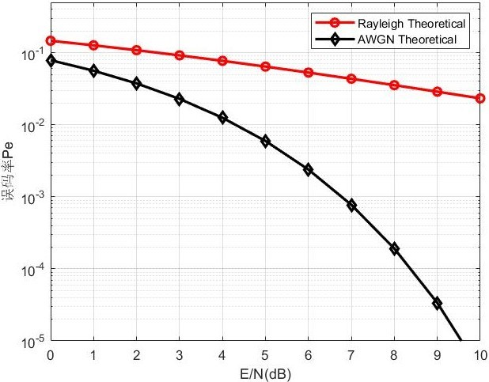
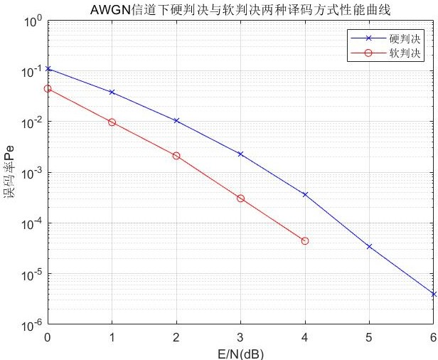
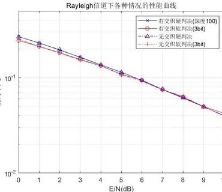
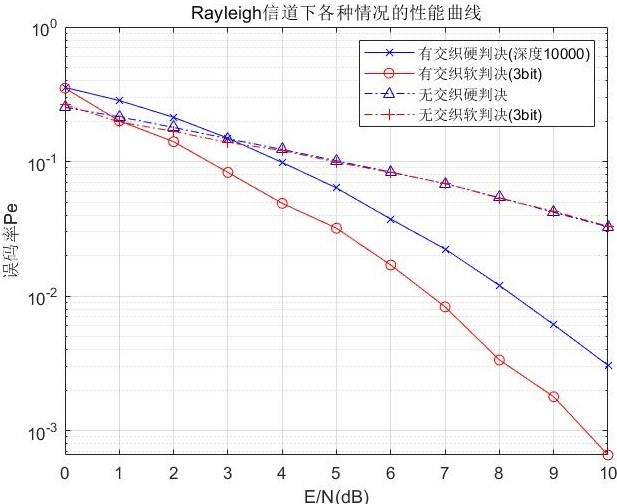
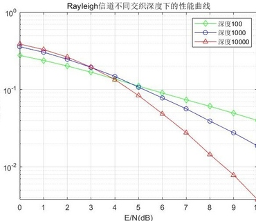

电子科技大学-信通学院-移动通信课程作业
# 作业要求
单径瑞利信道；最大多普勒频移100Hz。<br>
信源比特速率R_b:100Kbps。<br>
卷积编码：码率1/2；八进制生成多项式(561，753)。<br>
交织：行列交织，深度100<br>
仿真点数1,000,000,000。<br>
译码方式硬判决译码与软判决译码(3bits)。<br>
Q1:AWGN信道下硬判决与软判决误码率曲线仿真。<br>Q2：单径瑞利信道下(最大多普勒频移100Hz)有无交织，不同译码条件下的误码率曲线仿真。<br>Q3：不同深度下(自拟)的误码率曲线仿真<br>
# 实现
## 前言
在无编码无交织条件下，AWGN信道与瑞利信道理论误码率为：<br>
<br>
## Q1
卷积码可以用MATLAB函数poly2trellis与convenc实现。硬判决与软判决维特比译码可以用poly2trellis函数实现。<br>
交织用matlab自带的matintrlv函数实现。<br>
利用Eb/NO计算噪声功率N0公式(实信号):N0 = 0.5*(F_s/R_b)*10.^(-Eb/N0/10)。<br>
噪声序列生成：noise= sqrt(N0).*randn(1,4*simulation_point)。<br>
<br>
如上是AWGN信道下误码率曲线仿真结果。由此可以得出：<br>
①当𝐸_𝑏/𝑁_0=6dB时，硬判决译码下，系统的误码率就达到了10^(−5) 之下，与𝐸_𝑏/𝑁_0=10dB时无编码理论误码率在同一量级。这说明信道编码可以提升系统误码性能。<br>
②软判决译码下的误码率曲线在硬判决下的误码率曲线的下方。这说明在软判决译码下，系统的误码性能更好。<br>
## Q2
### Rayleigh 信道仿真思路
①经过单径瑞利信道后，信号的包络服从瑞利分布。因此可以通过将基带信息序列乘一个服从瑞利分布的随机变量来对通过单径瑞利信道后的信号进行仿真。<br>
②因为单径瑞利信道的最大多普勒频移为𝑓_𝑑=100𝐻𝑧。因此信道的相关时间约为〖1/𝑓〗_𝑑。在这段时间内编码器的输出比特数为𝑛𝑢𝑚=2𝑅_𝑏/𝑓_𝑑=2000。因此每𝑛𝑢𝑚个点就会经历相同的衰落。<br>
```Matlab
EbN0 = 10;%取0~10dB 
N0 = 0.5*(F_s/(2*R_b))*10.^(-EbN0/10);%算出样本点噪声功率
noise = sqrt(N0).*randn(1,4*simulation_point);%算出样本点噪声功率
fd = 100; %最大多普勒频移
h=ones(1,2*simulation_point);
num=2*R_b/fd;%相干时间内编码器输出bit数
division2=2*simulation_point/(2*R_b/fd);
for i=1:division2
    temp_h = sqrt(1/2)*(randn(1,1)+j*randn(1,1));%复高斯分布
    h((i-1)*num+1:i*num)=abs(temp_h);%包络服从瑞利分布
end
for i = 1:2*simulation_point
    h_data((i-1)*2+1:i*2) = h(i);%还需上采样，因为信息序列上采样后的点与上采样之前的点经历的是相同衰落（同一段时间多采了几个点）
end
handle_data = sample_data.*h_data+noise;%瑞利信道的输出
```
### Rayleigh 信道仿真结果如下
<br>
**结论**<br>
①无交织的硬判决译码和无交织的软判决译码的误码率曲线几乎重合，且与Rayleigh信道下无编码的误码率曲线几乎一致。这说明对于Rayleigh信道下成串出错的情况，信道编码技术无法有效检测校正，此时需要联合使用信道编码和交织技术。<br>
②有交织误码率曲线与无交织误码率曲线几乎重合。这是由于100小于最小交织器深度。<br>
**将深度改为10,000有如下结果**<br>
<br>
可以观察到到一下两个现象<br>
①可以明显的观察到有交织曲线（实线）位于无交织曲线（点划线）的下方，即按深度10000交织后系统的误码性能提升了。<br>
②有交织的硬判决译码与软判决译码的误码率曲线也分离开来。这再一次说明了Rayleigh信道下需要联合使用交织与信道编码技术。<br>
## Q3
深度分别为10^2,10^3,10^4时，硬判决译码下误码率曲线如下：<br>
<br>
**结论**<br>
①因为最小交织器深度为2000。故与理论误码率曲线相比，深度100与深度1000的系统误码率没有得到明显改善。误码率仍在同一量级。但是相较于深度为100的情况，深度为1000时系统误码性能略有改善。<br>
②深度为10000时，与理论误码率曲线相比，系统的误码率曲线在𝐸_𝑏/𝑁_0为10dB时降到了10^(−2)之下。系统的误码性能得到了明显的改善。<br>
[回到顶部](#readme)
